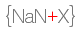
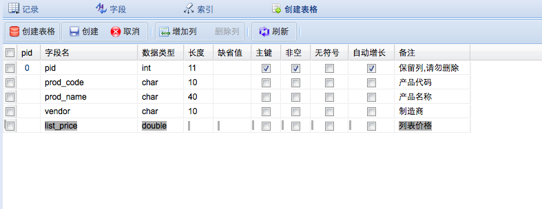
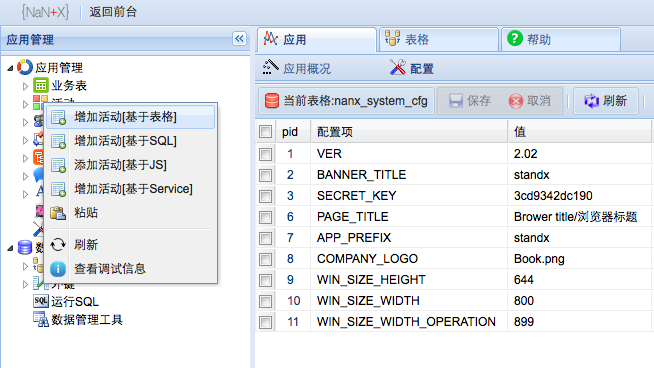
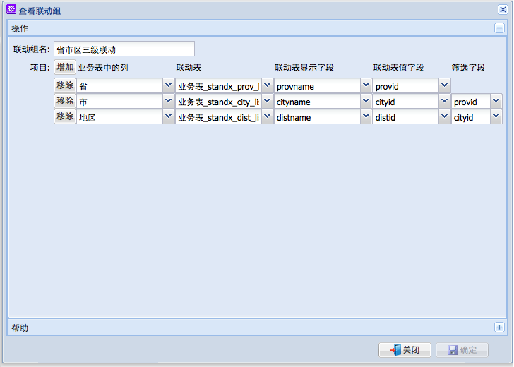

# NaNX
The meaning of NaNX is: NaN is a term in JavaScript, and X represents extensibility.

## Summary

The purpose of this code repository is to develop a customizable/reusable CRUD component. It abstracts a DataGrid that can be configured with elements such as: data source, fields to display in the table, dropdown relationships between fields, and field presentation (title, width, etc.).

## Features
It provides a standard set of buttons for directly offering editing, deleting, and adding record functionalities. Based on the configuration, the front end will directly display a form.

The data source can be defined as a database table or SQL, which will greatly reduce the workload of CRUD tasks.

## Screen Shots (Chinese Version)

